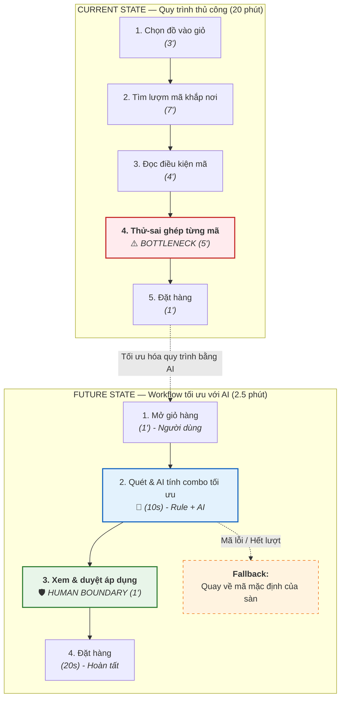
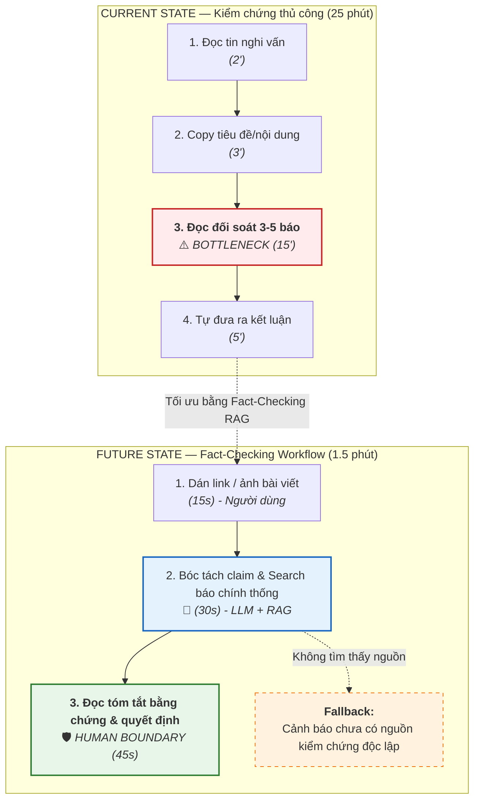
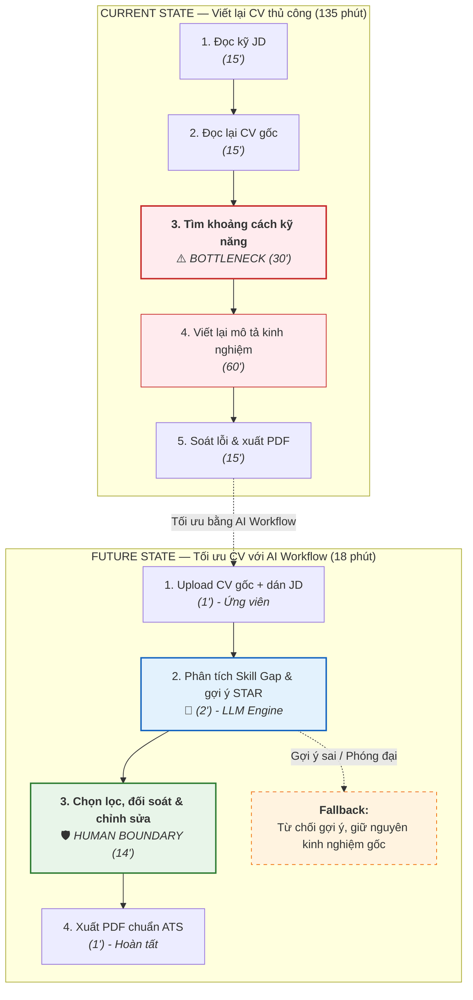

# 01 — Individual Problem Scan

> Điền theo Phase 1 + Phase 2 trong `01-worksheet.md`. Tự scan trước, dùng AI sau để phản biện. Không copy ví dụ Weekly Report.

## Thông tin cá nhân

- Họ và tên: Trần Tuấn Cường
- Mã học viên: 2A202602717
- Vai trò / bối cảnh (VD: sinh viên năm X, intern PM, ...): Sinh viên
- Công việc hằng tuần (3-5 gạch đầu dòng để soi problem): 
  - Học tập tại trường
  - Nghiên cứu đồ án
  - Học thêm kỹ năng mới
  - Tìm kiếm cơ hội việc làm    

---

## Phase 1 — Scan 5+ problems (tối thiểu 5, khuyến khích 8-10)

**Cách điền:** mỗi dòng = việc gì + ai chịu + đo bằng gì. Cột `Dấu hiệu thật` bắt buộc có số: mất bao lâu (bấm giờ mấy lần), mấy lần/tuần, bao nhiêu người gặp, log/ticket/quote nào.

| # | Lăng kính (Lặp lại / Tốn thời gian / AI có thể tốt hơn / Pain từ người khác) | Problem quan sát được | Ai chịu ảnh hưởng? | Dấu hiệu thật (số + bằng chứng) |
|---|---|---|---|---|
| 1 |Tốn thời gian | Người mua hàng phải thu thập thủ công các mã giảm giá, đa số các mã giảm giá không liên quan đến mặt hàng cần mua hoặc vouchers dính các điều kiện mà mặt hàng không đáp ứng | Người mua hàng | Các dịp ngày lặp luôn là thời điểm nhiều người mua sắm qua các nền tảng thương mại điện tử, 59% người mua hàng cho rằng chương trình khuyến mãi là 1 trong các lý do chính khiến người tiêu dùng ưu tiên việc mua sắm qua mạng |
| 2 | Lặp lại | Các tin giả, AI tạo ra gây hoang mang dư luận, xã hội gây ảnh hưởng đến các cá nhân, tổ chức, doanh nghiệp | Cá nhân, tổ chức, doanh nghiệp | Trong thời điểm từ 2022-2024, mỗi năm tin giả, tin sai sự thật tán phát từ 100.000 – 180.000 lượt tin, bài viết, hình ảnh, video clip trên các nền tảng mạng xã hội, diễn đàn.  |
| 3 | AI có thể tốt hơn | Kẻ gian tạo website phishing, giả mạo ngân hàng/cơ quan công an và gửi tin nhắn/gọi điện lừa đảo quy mô lớn; danh sách đen (blacklist) thủ công luôn cập nhật chậm hơn kẻ tấn công. | Cá nhân, tổ chức, doanh nghiệp | Theo Bộ Công an, trong năm 2023, cả nước ghi nhận hơn 5.900 vụ lừa đảo trực tuyến, tăng 30% so với năm trước, với số tiền thiệt hại lên tới hàng nghìn tỷ đồng |
| 4 | Tốn thời gian | Các tài liệu học tập hay bài báo khoa học thường dài và hay gặp phải vấn đề wall of text khiến cho học sinh, sinh viên dễ nản và khó tìm các dữ kiện liên quan đến câu hỏi của mình | Sinh viên, học sinh | Gần 60% học sinh Việt chưa đạt mức đọc hiểu cơ bản |
| 5 | Tốn thời gian | Người lao động mất hàng chục giờ nộp hồ sơ mù quáng do mô tả công việc (JD) mơ hồ; nhà tuyển dụng mất 70%–80% thời gian sàng lọc hàng trăm CV không đạt chuẩn | Người lao động, nhà tuyển dụng | Hơn 75% CV bị loại trước khi một nhân viên HR nào đó nhìn thấy chúng? Không phải vì ứng viên không đủ tiêu chuẩn. Mà vì chúng bị hệ thống ATS lọc tự động loại ra từ đầu. |

> Gợi ý tự soi: tuần trước mất nhiều thời gian nhất vào việc gì? Việc gì hay trì hoãn? Người khác hay hỏi lại câu gì? Workflow nào ai cũng biết là chậm?

**AI đã dùng ở Phase 1 (nếu có):**
- Prompt đã hỏi: có bài toán nào gần gũi với sinh viên hơn không đặc biệt là sinh viên năm cuối
- Ý dùng được: Hỗ trợ Tổng quan tài liệu & Trích xuất tri thức nghiên cứu
- Ý bỏ vì không phải pain thật: 

**Self-check Phase 1:**
- [x] Đủ 5+ dòng, mỗi dòng có actor + số đo cụ thể
- [x] Dùng ít nhất 3/4 lăng kính
- [x] Không có dòng chung chung kiểu "mất nhiều thời gian"

---

## Phase 2 — Top 3 Problem Cards

### 2.1. Chọn top 3

Giữ bài nào: actor cụ thể, workflow vẽ được 3-7 bước, bottleneck ở 1 bước, impact đo được. Loại bài quá rộng.

| Rank | Problem (copy từ bảng scan) | Vì sao chọn (2-3 ý) | Điều còn chưa chắc |
|---|---|---|---|
| 1 |Người mua hàng phải thu thập thủ công các mã giảm giá, đa số các mã giảm giá không liên quan đến mặt hàng cần mua hoặc vouchers dính các điều kiện mà mặt hàng không đáp ứng | Tối ưu thời gian kiếm mã giảm giá do các mã tốt thường có giới hạn và việc có những vouchers phù hợp và tối ưu giúp người tiêu dùng tiết kiệm được tiền | Khả năng tìm mã giảm giá theo thời gian thực do lượt dùng lớn và chính sách ngăn chặn của các nền tảng thương mại điện tử |
| 2 | Các tin giả, AI tạo ra gây hoang mang dư luận, xã hội gây ảnh hưởng đến các cá nhân, tổ chức, doanh nghiệp | Việc phát hiện và cảnh báo sớm sẽ giúp người đọc tránh tiếp nhận phải các thông tin giả mạo, góp phần tăng dân trí trên mạng xã hội | Các thông tin theo dạng tin đồn, quan điểm cá nhân thì chưa có nguồn kiểm chứng |
| 3 |Người lao động mất hàng chục giờ nộp hồ sơ mù quáng do mô tả công việc (JD) mơ hồ; nhà tuyển dụng mất 70%–80% thời gian sàng lọc hàng trăm CV không đạt chuẩn | Ứng viên tiết kiệm thời gian tìm việc trong bối cảnh thị trường lao động đầy biến động và giúp các nhà tuyển dụng tìm được các cá nhân phù hợp | Việc sắp xếp mức độ ưu tiên giữa các CV (trường theo học, bằng cấp liên quan,...) |

### 2.2. Problem Cards chi tiết (lặp lại cho cả 3 cards)

---

#### Problem Card #1 — Tối ưu hóa tìm kiếm và áp dụng mã giảm giá phù hợp cho giỏ hàng TMĐT

```text
┌──────────────────────────────────────────────┐
│ PROBLEM CARD #1                              │
│                                              │
│ Problem 1 câu: Người mua sắm online mất      │
│ 15-20 phút/đơn thử mã thủ công nhưng hơn     │
│ 80% mã không hợp lệ hoặc không giảm tối đa.  │
│                                              │
│ Ai chịu ảnh hưởng? Người mua hàng online     │
│ (học sinh, sinh viên, nhân viên văn phòng)   │
│                                              │
│ Workflow hiện tại:                           │
│ 1. Chọn đồ → 2. Lượm mã → 3. Đọc điều kiện   │
│ → 4. Thử ghép mã → 5. Đặt hàng               │
│                                              │
│ Bước nghẽn nhất: Đọc điều kiện & thử ghép mã │
│ (5-9 phút/lần)                               │
│                                              │
│ Đo thành công bằng gì? Giảm từ 20 phút xuống │
│ dưới 2.5 phút; tỷ lệ áp dụng mã đạt >= 90%   │
│                                              │
│ Quick gut: □ No AI □ Rule ■ Workflow         │
│            □ Agent □ Chưa biết               │
└──────────────────────────────────────────────┘
```

**Draft workflow Card #1** (ASCII / Mermaid / ảnh đính kèm):

```text
CURRENT STATE — 20 phút

[1 Chọn đồ vào giỏ: 3'] → [2 Tìm lượm mã khắp nơi: 7'] → [3 Đọc điều kiện mã: 4'] → [4 Thử-sai ghép từng mã: 5']  <-- bottleneck → [5 Đặt hàng: 1']

FUTURE STATE — 2.5 phút

[1 Mở giỏ hàng: 1'] → [2 Auto-scan & AI tính combo voucher tối ưu: 10s] → [3 Người dùng xem kết quả & duyệt áp dụng: 1']  <-- human boundary → [4 Đặt hàng: 20s]

Fallback: nếu AI gợi ý lỗi hoặc mã bị sàn báo hết lượt đột xuất, hệ thống tự động quay về áp dụng mã mặc định có sẵn của sàn và thông báo lý do rõ ràng.
```

File đính kèm (nếu vẽ riêng): `01-individual-problem-scan-workflow-card-1.png`



---

#### Problem Card #2 — Xác thực nguồn gốc và kiểm chứng độ tin cậy của bài viết/tin tức trên mạng xã hội

```text
┌──────────────────────────────────────────────┐
│ PROBLEM CARD #2                              │
│                                              │
│ Problem 1 câu: Người dùng MXH mất 15-30 phút │
│ tra cứu chéo hoặc chia sẻ tin sai sự thật    │
│ do AI tạo vì thiếu công cụ đối soát tức thì. │
│                                              │
│ Ai chịu ảnh hưởng? Người đọc mạng xã hội,    │
│ học sinh, sinh viên, người làm nghiên cứu    │
│                                              │
│ Workflow hiện tại:                           │
│ 1. Đọc tin → 2. Copy nội dung → 3. Search    │
│ báo chí → 4. Đọc đối soát → 5. Kết luận      │
│                                              │
│ Bước nghẽn nhất: Đọc đối soát 3-5 báo chính  │
│ thống (15 phút/lần)                          │
│                                              │
│ Đo thành công bằng gì? Giảm thời gian kiểm   │
│ chứng từ 25 phút → dưới 1.5 phút/bài         │
│                                              │
│ Quick gut: □ No AI □ Rule ■ Workflow         │
│            □ Agent □ Chưa biết               │
└──────────────────────────────────────────────┘
```

**Draft workflow Card #2:**

```text
CURRENT STATE — 25 phút

[1 Đọc bài nghi vấn: 2'] → [2 Copy nội dung tìm kiếm: 3'] → [3 Đọc đối soát 3-5 báo chính thống: 15']  <-- bottleneck → [4 Tự kết luận: 5']

FUTURE STATE — 1.5 phút

[1 Dán link/ảnh bài viết: 15s] → [2 AI bóc tách claims & đối chiếu nguồn chính thống: 30s] → [3 Người dùng đọc tóm tắt bằng chứng & quyết định: 45s]  <-- human boundary

Fallback: nếu không tìm thấy thông tin trên các báo chính thống, hệ thống hiển thị cảnh báo "Chưa có nguồn kiểm chứng độc lập, khuyến cáo người dùng không chia sẻ" chứ tuyệt đối không tự kết luận đúng/sai.
```

File đính kèm: `01-individual-problem-scan-workflow-card-2.png`



---

#### Problem Card #3 — Sàng lọc và tối ưu hóa hồ sơ ứng tuyển (CV) theo Mô tả công việc (JD)

```text
┌──────────────────────────────────────────────┐
│ PROBLEM CARD #3                              │
│                                              │
│ Problem 1 câu: Sinh viên/người tìm việc mất  │
│ 2-3 giờ sửa CV theo JD nhưng hơn 75% hồ sơ   │
│ bị ATS loại do thiếu từ khóa chuyên môn.     │
│                                              │
│ Ai chịu ảnh hưởng? Sinh viên năm cuối, ứng   │
│ viên tìm việc và nhà tuyển dụng (HR)         │
│                                              │
│ Workflow hiện tại:                           │
│ 1. Đọc JD → 2. Đọc CV → 3. Soi skill gap     │
│ → 4. Viết lại mô tả → 5. Soát lỗi & xuất PDF │
│                                              │
│ Bước nghẽn nhất: Phân tích khoảng cách kỹ    │
│ năng & viết lại mô tả (90 phút/lần)          │
│                                              │
│ Đo thành công bằng gì? Giảm từ 135 phút      │
│ xuống dưới 18 phút; điểm ATS tăng >= 80%     │
│                                              │
│ Quick gut: □ No AI □ Rule ■ Workflow         │
│            □ Agent □ Chưa biết               │
└──────────────────────────────────────────────┘
```

**Draft workflow Card #3:**

```text
CURRENT STATE — 135 phút

[1 Đọc kỹ JD: 15'] → [2 Đọc lại CV gốc: 15'] → [3 So sánh tìm khoảng cách kỹ năng: 30']  <-- bottleneck → [4 Viết lại câu chữ mô tả kinh nghiệm: 60'] → [5 Soát lỗi & xuất PDF: 15']

FUTURE STATE — 18 phút

[1 Upload CV gốc + dán JD: 1'] → [2 AI phân tích Skill Gap & đề xuất bullet points theo STAR: 2'] → [3 Ứng viên chọn lọc, kiểm tra tính trung thực & chỉnh sửa: 14']  <-- human boundary → [4 Xuất file PDF chuẩn ATS: 1']

Fallback: nếu AI gợi ý phóng đại kỹ năng mà ứng viên chưa từng làm, ứng viên nhấn "Từ chối gợi ý" và hệ thống hoàn nguyên về nội dung gốc của ứng viên.
```

File đính kèm: `01-individual-problem-scan-workflow-card-3.png`



---

### 2.3. Card muốn pitch nhất (chuẩn bị 2 phút)

**Card tôi muốn pitch nhất:**

```text
Problem Card #3 — Sàng lọc và tối ưu hóa hồ sơ ứng tuyển (CV) theo Mô tả công việc (JD)
```

**Vì sao (2-3 câu: workflow gì, số đo gì, impact gì):**

```text
Đây là bài toán có workflow lặp lại vô cùng nhức nhối với mọi sinh viên năm cuối chuẩn bị ra trường: từ đọc JD -> bóc tách từ khóa -> đối chiếu kinh nghiệm -> viết lại CV cho chuẩn ATS. 
Về mặt số đo, giải pháp rút ngắn thời gian chuẩn bị 1 bản CV từ 135 phút xuống còn 18 phút, đồng thời nâng điểm tương thích từ khóa ATS từ ~40% lên trên 80%. 
Impact mang lại rất lớn: giúp ứng viên không bị kiệt sức khi nộp hồ sơ hàng loạt, giảm tỷ lệ bị hệ thống ATS tự động loại oan uổng (hiện chiếm tới 75%) và giúp nhà tuyển dụng nhận được đúng hồ sơ nổi bật năng lực phù hợp.
```

**Câu hỏi tôi muốn nhóm challenge (1-2 câu hỏi đúng chỗ yếu):**

```text
1. Nếu AI gợi ý từ khóa kỹ năng để "qua mặt" ATS nhưng ứng viên thực tế chưa làm bao giờ, làm thế nào để ngăn chặn tình trạng phóng đại hồ sơ khiến ứng viên bị "bắt bài" khi phỏng vấn thật?
2. Hiện nay các hệ thống ATS hiện đại (như Taleo, Workday) có thuật toán phát hiện và trừ điểm CV dùng AI tự viết hay không, và giải pháp của ta đảm bảo văn phong tự nhiên thế nào?
```

**AI phản biện Card (nếu có):**
- Điểm yếu AI chỉ ra: AI ban đầu có xu hướng viết lại toàn bộ nội dung quá "mượt" và dễ tự bịa số liệu thành tích nếu không có ràng buộc chặt chẽ; ranh giới giữa "tối ưu diễn đạt" và "làm khống kinh nghiệm" rất mong manh.
- Tôi sửa gì: Thiết kế Human Boundary nghiêm ngặt: AI tuyệt đối không tự bịa kinh nghiệm mới mà chỉ phân tích ma trận kỹ năng (Skill Gap) và gợi ý khung diễn đạt STAR (Situation - Task - Action - Result) dựa trên dự án thật của ứng viên; ứng viên phải tự tay điền số liệu và xác nhận từng gạch đầu dòng trước khi xuất file.

### Self-check nộp phần 01
- [x] Có 5+ problems + top 3 Cards đủ field
- [x] Mỗi Card có workflow trước/sau + bottleneck + metric + fallback
- [x] Đã chọn 1 card pitch + câu hỏi challenge

